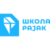
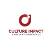

# 💻 Developers Club - Software Engineering Hub

## 🧭 About Us

Developers Club is a group of IT professionals dedicated to career development, networking, and knowledge sharing within the tech industry. It provides a platform for members to connect, exchange ideas, and enhance their professional growth.

The club offers various resources, including events and opportunities for building networks, helping members advance their careers and establish their reputations in the IT world.

By joining Developers Club, IT professionals gain access to networking opportunities, career resources, and skill development support.

### 🎯 Our Mission:

To unite the IT community by fostering knowledge exchange, professional growth, and expertise development, helping our members excel in their craft and become authorities in the IT field.

### 🌅 Our Vision:

We envision Developers Club as the go-to choice for IT professionals in the region, offering opportunities for networking, skill development, and knowledge sharing.

### 💎 Our Values

- **Integrity**: We choose what’s right, not what’s easy. We stand by what we say and do.
- **Mastery**: We strive for expertise and innovation, asking the right questions and finding the best solutions.
- **Professionalism**: We take pride in our work, aiming for quality and dedication to getting the job done.
- **Inspiration**: We are honored to inspire others and aim to push people to achieve more than they thought possible.
- **Humility**: We acknowledge our limits, accept what we don’t know, and recognize that mistakes happen.

## 🎟 Become a Member

- **[Join here](https://forms.gle/kFiA1KkoXjrKGMDV6)**   👈

## 👋 Meet Our Team

- **Aleksandar Sabo** - UO [[LinkedIn 🔗](https://www.linkedin.com/in/alxsabo/)]
- **Sebastian Novak** - UO [[LinkedIn 🔗]](https://www.linkedin.com/in/1337429001/)
- **Dejan Miličić** - UO [[LinkedIn 🔗]](https://www.linkedin.com/in/dejanmilicic/)
- **Silvija Baro Čalija** - UO [[LinkedIn 🔗]](https://www.linkedin.com/in/sbaro/)
- **Ognjen Stanić** - UO [[LinkedIn 🔗]](https://www.linkedin.com/in/ognjen-stanic/)
- **Nikola Knežević** - UO [[LinkedIn 🔗]](https://www.linkedin.com/in/knezevicdev/)

## 🤝 Our Friends
Organizations and companies that support Developers Club's work.

    
    
    
    

    
    
    
    

---

💡 **Developers Club** is the go-to place where IT professionals can find useful advice, resources, and inspiration to grow and advance their careers.

## 🔗 Let’s Connect!

Network with other developers, build your reputation, and elevate your career!

